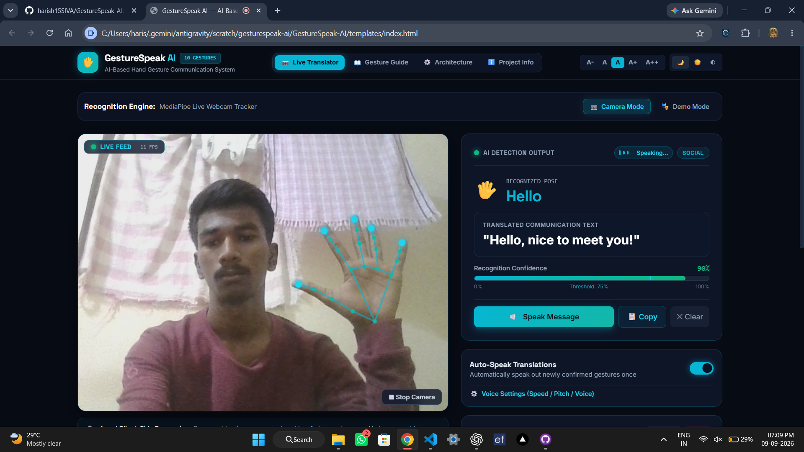

# GestureSpeak AI
### AI-Based Hand Gesture Communication System for Non-Speaking Individuals

> **AI Immersion C29 Project Deliverable** | Prototype — Predefined Everyday Needs

---

## 🌟 Overview
**GestureSpeak AI** is an accessible, real-time communication web system engineered to empower non-speaking individuals, post-operative patients, and individuals with speech impairments. 

By leveraging computer vision and hand landmark tracking, the system recognizes **10 predefined everyday physical hand gestures** in real time, translates them into high-contrast sentences, and vocalizes them using browser-native text-to-speech.

---

## 🔄 Core Recognition Pipeline
```
Webcam
  ↓ [Browser captures camera frames]
OpenCV Frame Decode
  ↓ [JPEG frame decoded on the local Flask server]
MediaPipe Hands
  ↓ [21 hand landmarks extracted]
Landmark-Based Gesture Classification
  ↓ [Rule-based finger states, distances and pose conditions]
Confidence Evaluation
  ↓ [Gesture confidence returned by the classifier]
Temporal Confirmation
  ↓ [Same gesture must remain stable for about 1.1 seconds]
Text Translation & Display
  ↓ [Gesture mapped to an everyday communication message]
Voice Output (Web Speech API)
  [Optional browser speech synthesis]

```

---

## ✋ 10 Predefined Communication Gestures

| # | Gesture | Icon | Category | Pose Requirement | Output Sentence |
|---|---|---|---|---|---|
| 1 | **FOOD** | 🍛 | Need | Open palm, five fingers extended | "I want food." |
| 2 | **WATER** | 💧 | Need | Three fingers extended | "I need water." |
| 3 | **TEA / COFFEE** | ☕ | Need | Index and middle fingers extended | "I want tea or coffee." |
| 4 | **HELP** | 🆘 | Need | Closed fist, all fingers folded | "I need help." |
| 5 | **YES** | 👍 | Response | Thumb pointing upward | "Yes." |
| 6 | **NO** | 👎 | Response | Thumb pointing downward | "No." |
| 7 | **PLEASE** | 🙏 | Social | Two hands held close together | "Please." |
| 8 | **WANT THAT** | ☝️ | Request | Only the index finger extended | "I want that." |
| 9 | **OKAY** | 👌 | Response | Thumb and index finger form an OK sign | "I am okay." |
| 10 | **HELLO** | 👋 | Social | Open hand waved side to side | "Hello. Please notice me." |

---

## 🚀 How to Run the Application

### Python + Flask + OpenCV + MediaPipe

1. Install Python 3.10 or 3.11.

2. Install dependencies:

```bash
py -m pip install -r requirements.txt
   ```

---

## Project Preview



## 💻 Tech Stack & Architecture
- **Frontend UI:** Modern Dark AI Theme with Cyan/Teal Accents (`#06b6d4`, `#14b8a6`, `#070b14`), Tailwind CSS, Space Grotesk + Inter fonts.
- **Computer Vision:** MediaPipe Hands (21 3D skeleton keypoints), OpenCV (`cv2`).
- **Classification Engine:** Multi-point geometric angle & Euclidean distance vector analysis (`gesture_engine.py` & in-browser JS equivalent).
- **Audio Output:** Web Speech API (`SpeechSynthesis`) with configurable rate, pitch, and voice profiles.
- **Accessibility:** Dynamic font scaling (A- to A++), High Contrast mode, screen-reader friendly ARIA markup.
- **Privacy Guarantee:** 100% client-side local computation. No video or biometric data is stored or transmitted.

---

*GestureSpeak AI — AI Immersion C29 Engineering Project*
